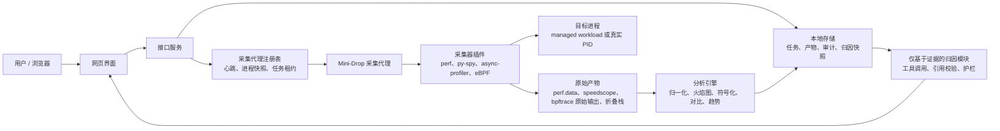
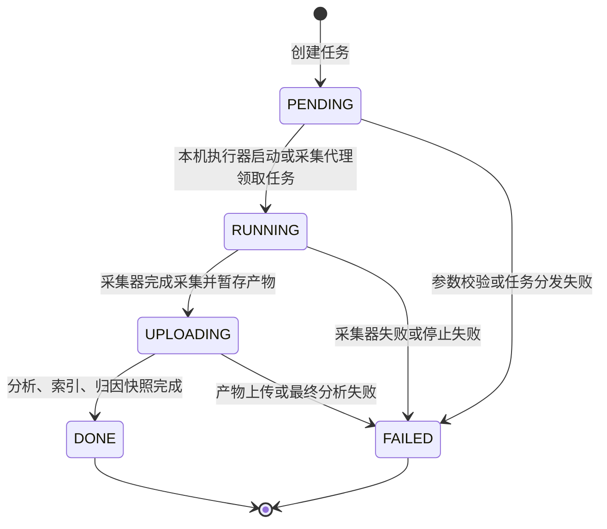
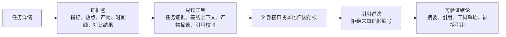

# Mini-Drop 设计文档

Mini-Drop 是对内部生产版 Drop 的本地压缩复刻。它保留一站式性能诊断平台的主路径：用户在网页界面发起任务，服务端管理任务状态和历史，采集代理在目标环境执行采集，分析引擎统一解析采样产物，智能归因模块基于证据输出可验证诊断结论。当前版本聚焦单机单用户闭环，覆盖 C++、Go、Python、Java 等诊断入口，并为 Linux 真实采集和后续远端采集代理演进保留接口。

## 1. 架构图



系统按八个模块拆分：

- **网页界面**：发起任务，展示任务状态、火焰图、产物、审计记录、对比趋势和诊断结论。
- **接口服务**：校验请求，管理任务生命周期，维护产物索引，对外提供进程、采集代理、目录和归因接口。
- **采集代理**：向服务端注册，定期心跳，上报进程快照，领取排队任务，并在目标环境执行采集器。
- **采集器插件层**：用统一接口封装 `perf`、`py-spy`、`async-profiler`、`eBPF`。
- **分析引擎**：把不同采集器的产物归一化为热点函数、折叠栈、火焰图、对比和趋势载荷。
- **符号化**：尽量保留或推导符号、模块、文件、行号信息，让热点更可读。
- **智能归因模块**：只消费结构化证据和允许的只读工具，输出可校验引用。
- **本地存储**：使用本地文件系统保存任务元数据、采样产物、审计日志、索引、持续剖析切片和归因快照。

## 2. 状态机迁移图



每次状态迁移都会持久化原因，并写入审计事件。网页界面会拉取任务详情、运行态、产物、审计、趋势、持续剖析窗口和归因快照。采集代理健康状态单独表达为 `online`、`stale`、`lost`，避免任务状态和采集代理心跳互相覆盖。

## 3. 关键决策

1. **优先本地可复现，但保留采集代理形态**  
   当前交付目标是本机快速跑通，但任务仍然可以由独立采集代理领取执行。这样既能满足 `docker compose up` 演示，也保留了生产版 Drop 的控制面雏形。

2. **使用文件系统存储，而不是数据库**  
   本地 JSON 和 artifact 文件更容易检查、复制和演示，也降低了评审机器的依赖成本。代价是查询能力和并发能力有限，但多用户、多租户和大规模检索不属于当前阶段。

3. **采集器成熟度必须显式暴露**  
   采集器结果会标记为 `real`、`partial-real` 或 `fallback`。这能避免把平台限制、权限问题或未完全结构化的原始数据包装成“真结果”。

4. **进程发现优先相信采集代理视角**  
   PID 校验和进程选择优先使用采集代理上报的进程快照，而不是服务端本机看到的进程列表。这样界面选择的对象和真正执行采集的环境保持一致。

5. **归因模块必须仅基于证据**  
   模型可以总结、比较和排序，但不能虚构栈帧、文件、行号或根因。所有引用都必须映射回当前证据包。

6. **演示自带目标服务**  
   仓库内置一个 Go HTTP 服务，并配套负载、IO 抖动、调度抖动命令。评审不需要额外克隆其他项目，也能拿到稳定可附着的目标进程。

## 4. 取舍说明

- **文件系统 vs 数据库**：文件系统更适合本地演示和产物核对；数据库更适合生产级检索和并发。
- **轮询界面 vs WebSocket**：轮询实现更简单，足够支撑本地任务进度；WebSocket 后续可减少延迟和请求噪声。
- **bpftrace vs libbpf-go**：`bpftrace` 更适合两周内快速证明 eBPF 路径；`libbpf-go` 更适合长期稳定的结构化事件输出。
- **托管负载回退 vs 严格失败**：回退能保证基础闭环不断，但必须在界面和采集来源说明中清楚标识，不能误导用户。
- **单采集代理优先 vs 调度系统**：当前租约模型简单可控；后续生产化需要主机选择、能力匹配和多采集代理调度。

## 5. AI 协作章节

AI 层被设计成受约束的诊断助手，而不是自由发挥的归因模型。



主要护栏：

- 模型输入前先枚举证据编号。
- 模型只能请求系统声明过的只读工具。
- 模型输出的引用会和证据包做校验。
- 无法映射回证据的引用会被拒绝，并在界面中展示。
- 外部模型不可用、超时或返回非法结构时，系统会降级为本地证据摘要。

这个设计让 AI 负责“组织证据和表达结论”，而不是替代真实采样和证据链。

## 6. 性能自证小节

当前可证明的能力：

- `docker compose up` 可以启动接口服务和采集代理。
- `make demo` 可以启动内置 Go 目标服务，并打印真实 host PID。
- `perf` 在 Linux 上已经验证为 real，链路为 `perf record + perf script`，保留 `perf.data`、script 输出、collapsed stacks 和 collection path provenance。
- `py-spy` 在 Linux 上已经验证真实 Python attach 证据。
- `eBPF` 能通过 `bpftrace` 真正执行并保留原始产物，但当前 Go 演示中出现过原始输出只有 `Attaching 2 probes...` 的情况，这不应该被当成完整真实热点证据。
- 持续剖析可以保留切片窗口，并在界面中回放历史。
- 开发过程中使用过 `npm run typecheck`、`npm run test`、`npm run build`、`smoke:perf-linux`、`smoke:ebpf-linux`、`smoke:compare-trend`、`smoke:continuous-profile` 等验证命令。

这里最重要的自证不是“状态显示成功”，而是采集来源说明：每个任务都会保留命令路径、来源类型、原始信号、预期产物和说明，让评审可以核对数据究竟来自真实采集器、部分真实采集器，还是回退路径。

## 7. 当前差距

- eBPF 当前证明了命令执行和原始产物保留，但还没有稳定证明“结构化真实热点”。
- eBPF 为 `partial-real` 时，`cpu`、`blocked`、`gc`、`syscalls` 四个高层指标仍可能来自回退路径生成的负载报告。
- `async-profiler` 已有接口和部分链路，但 Java 真实验证还没有达到 `perf` 和 `py-spy` 的成熟度。
- 智能归因已经完成 evidence-only 输入、只读工具白名单、引用校验、外部接口接入和安全降级，但还没有整理成独立的“智能归因评测报告”交付物。
- 本地文件存储不适合多用户、多主机生产规模。
- 采集代理调度仍是基础租约模型，还不是完整生产控制面。

## 8. 如果再有 7 天我会做什么

下一阶段优先把 7 天集中投入到 eBPF 能力成熟度上。

1. **第 1 天：修正 eBPF 来源说明口径**  
   把只有 `Attaching 2 probes...` 的结果标记为 `probe-attached-no-samples` 或 fallback，而不是 `partial-real`。同时补分类测试。

2. **第 2 天：补真正的 IO 和调度探针**  
   增加块设备 IO 延迟和调度延迟的 bpftrace 脚本，不再只依赖 `profile:hz` 用户态栈采样。

3. **第 3 天：让 eBPF 输出结构化事件**  
   输出稳定的行式记录，例如 `event,type,pid,comm,latency,count,stack`，减少对 bpftrace 默认映射表输出格式的依赖。

4. **第 4 天：拆分指标来源**  
   为每个指标增加来源字段，在界面中明确标记 `real`、`derived` 或 `fallback-estimated`。

5. **第 5 天：增强 IO / 调度异常可视化**  
   在火焰图之外补延迟分桶、事件计数和分布变化，因为 IO 和调度问题不一定适合只用 CPU 栈表达。

6. **第 6 天：强化 Linux 演示验证**  
   让 `make demo-io` 和 `make demo-sched` 能稳定制造 eBPF 可见的分布变化，并增加冒烟测试，避免只采到启动横幅。

7. **第 7 天：整理最终演示证据**  
   更新跑通手册，补产物示例，补齐智能归因评测报告，录制 15 分钟演示：基线、异常注入、eBPF 可视化变化、仅基于证据的 AI 总结。

智能归因评测报告会在这 7 天里补齐，重点覆盖：

- 证据输入是否完整：火焰图、热点函数、采集元数据、历史基线、产物摘要和审计记录。
- 工具约束是否生效：模型只能使用 `get_task_evidence_bundle`、`get_baseline_context`、`get_artifact_excerpt`、`validate_citations` 等只读工具。
- 幻觉防御是否有效：无法映射到证据编号的引用会被拒绝，未验证结论不会作为确定根因展示。
- 降级路径是否安全：外部模型不可用、超时、返回非法结构或请求越权工具时，系统只输出安全摘要和限制说明。
- 评测矩阵是否可复现：正常证据、缺失基线、错误引用、工具越权、模型超时和证据不足等场景都给出预期结果。

## 9. 演示路径

```bash
git clone https://github.com/starsky1391/mini_drop.git
cd mini_drop
docker compose up -d
make demo
```

打开 `http://127.0.0.1:8787/`，使用 `make demo` 打印的 PID 创建 `Go + eBPF` 或 `Go + perf` 任务，然后制造负载：

```bash
make demo-load
make demo-io
make demo-sched
```

如果 Linux 上 `perf` 或 `bpftrace` 需要 sudo：

```bash
bash scripts/setup-linux-collector-sudo.sh --user "$USER" --apply-sysctl
```
